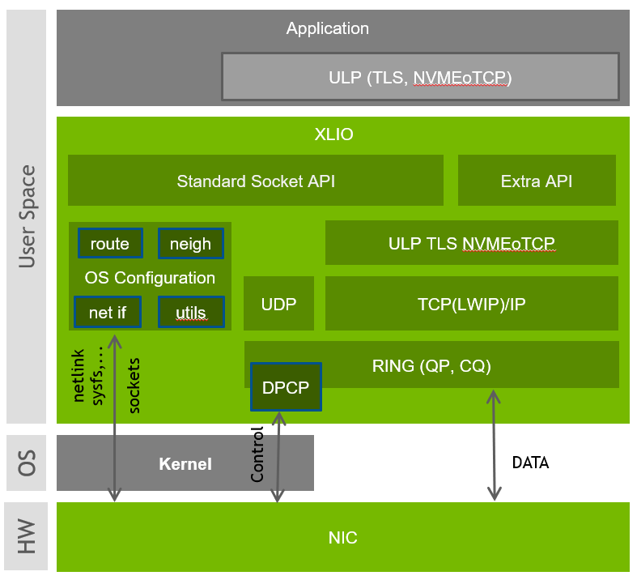

# XLIO - Accelerated IO SW library

The NVIDIA® Accelerated IO (XLIO) SW library boosts the performance of TCP/IP applications based on NGINX (CDN, DoH Etc.) and storage solutions as part of the SPDK. XLIO is a user-space software library that exposes standard socket APIs with kernel-bypass architecture, enabling a hardware-based direct copy between an application’s user-space memory and the network interface.

Coupling XLIO with NVIDIA ConnectX®-6 Dx, NVIDIA ConnectX®-7 or NVIDIA BlueField®-2 data processing unit (DPU) acceleration capabilities provides breakthrough performance of Transport Layer Security (TLS) encryption/decryption. It also enables working with features such as HW LRO/TSO and Striding-RQ which increase TCP performance, without application code changes and using a standard socket API.

Please visit our [documentation site](https://docs.nvidia.com/networking/category/xlio) for more details.

<hr>

* [Getting Started](#getting-started)
* [Architecture](#architecture)
* [Supported Transports](#supported-transports)
* [Supported CPU Architectures](#supported-cpu-architectures)
* [Supported NICs](#supported-nics)
* [Licenses](#licenses)
* [Information](#information)
* [Contribution](#contribution)
* [Configuration](#configuration)

<hr>

## Getting Started

### Prerequisits

#### Driver Stack

XLIO can work on top of both MLNX_OFED driver stack that supports Ethernet and on a lighter driver stack, MLNX_EN that supports only Ethernet.

[MLNX_OFED](https://network.nvidia.com/products/infiniband-drivers/linux/mlnx_ofed/)
[MLNX_EN](https://network.nvidia.com/products/ethernet-drivers/linux/mlnx_en/)

#### DPCP

DPCP (Direct Packet Control Plane) is mandatory to enable advanced HW features for supported NVIDIA HW.
Repository: [libdpcp](https://github.com/Mellanox/libdpcp.git)

```sh
$ ./autogen.sh
$ ./configure --prefix=/where/to/install
$ make -j
$ make install
```

### Building XLIO

Run the following commands from within the directory at the top of the tree:

```sh
$ ./autogen.sh
$ ./configure --prefix=/where/to/install --with-dpcp=/where/dpcp/installed --enable-utls
$ make -j
$ make install
```
--enable-utls : Enables uTLS HW offload for supported NVIDIA HW.

### Building XLIO using preinstalled dpcp

```sh
$ ./autogen.sh
$ ./configure --prefix=/where/to/install --with-dpcp --enable-utls
$ make -j
$ make install
```

### Usage Examples

#### Sockperf

LD_PRELOAD=libxlio.so sockperf \<params\>

Reposiroty: [Sockperf](https://github.com/Mellanox/sockperf)

#### nginx

LD_PRELOAD=libxlio.so XLIO_NGINX_WORKERS_NUM=\<N\> nginx \<nginx_params\>

N - Number of Nginx workers.

## Architecture



## Supported Transports

* IPv4/6
* TCP
* UDP

## Supported CPU Architectures

* [x86_64](https://en.wikipedia.org/wiki/X86-64)
* [Arm](https://www.arm.com/)

## Supported NICs

* NVIDIA ConnectX®-6
* NVIDIA ConnectX®-7
* NVIDIA BlueField®-2

## Licenses
See [LICENSE](./LICENSE) file

## Information
See [README](./README) file

## Contribution
[Contribution](./docs/contributing.md) guidelines for this project

## Configuration
[Configuration](./docs/configuration.md) options description
